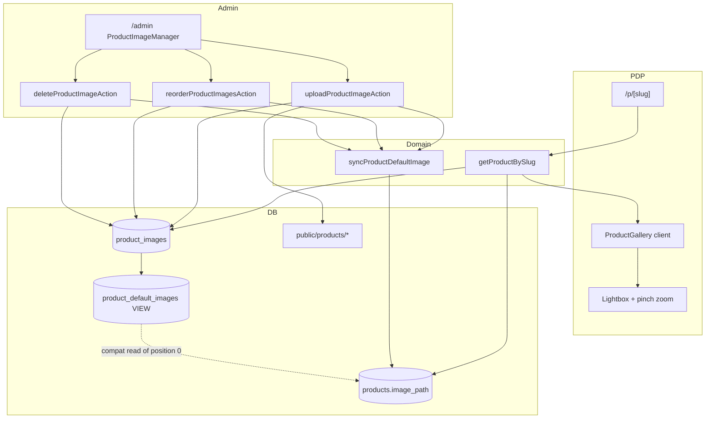

# BRK-6 — PDP multi-image gallery

## Architecture

## Data flow

1. Migration creates `product_images`, backfills from `products.image_path` at `position = 0`, and exposes `product_default_images` view.
2. Seed inserts a primary image plus additional editorial angles (front / back / detail / on-dog) for demo products.
3. PDP loads ordered images via `getProductBySlug` and renders `ProductGallery` (hero + thumbs + keyboard/swipe + lightbox).
4. Admin upload writes under `public/products/`, inserts a row, and keeps `products.image_path` aligned with position 0.
5. Drag-reorder persists all positions in one transaction, then re-syncs the default image path.

## Component behavior

| Component | Behavior |
| --- | --- |
| `ProductGallery` | Client island: selected index, fade on change, arrow/swipe nav, opens lightbox on hero click |
| Lightbox | Full-viewport overlay; Escape closes; pinch-to-zoom on touch |
| `ProductImageManager` | Admin list with drag reorder, file upload, delete |

## Dependencies

- Migration `drizzle/0003_product_images.sql`
- No CDN; local `public/products/` only
- Keeps `products.image_path` for tiles/cart backwards compatibility
