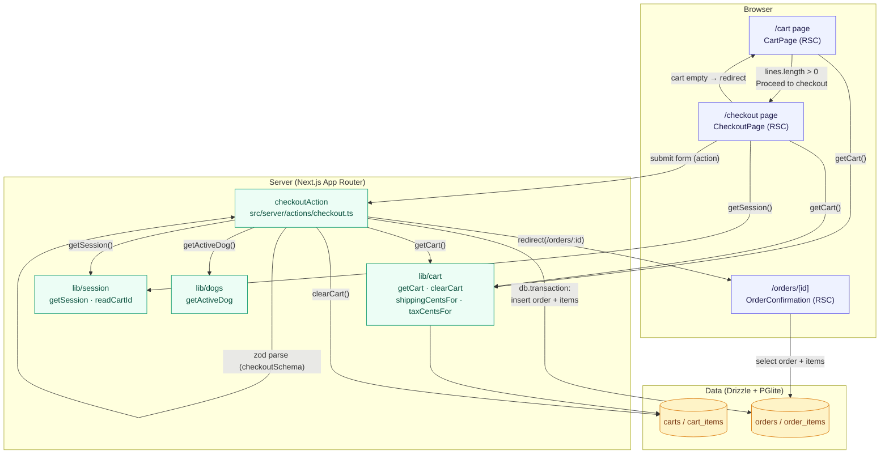

# Checkout Flow

How a shopper goes from a filled bag to a confirmed order in Barkenciaga.

The flow spans three routes (`/cart` → `/checkout` → `/orders/[id]`), one server action
(`checkoutAction`), and the cart/session/dog libraries backed by Drizzle + PGlite.

## End-to-end flow

## What happens at each step

1. **`/cart`** — `CartPage` calls `getCart()` and computes shipping/tax/total. When the
   bag has lines, it renders a **Proceed to checkout** link to `/checkout`.
2. **`/checkout`** — `CheckoutPage` re-reads the cart; an empty cart **redirects back to
   `/cart`**. It prefills the email from `getSession()` and renders the contact / shipping /
   payment form whose `action` is the `checkoutAction` server action.
3. **`checkoutAction`** — runs on submit:
   - `ensureDbReady()` then validates the form with `checkoutSchema` (Zod).
   - Re-fetches the cart and **throws if it is empty** (guards against stale submits).
   - Loads `getSession()` and `getActiveDog()` for `userId` / `dogName`.
   - Recomputes `subtotal → shipping → tax → total` server-side (never trusts the client).
   - In a single `db.transaction`, inserts the `orders` row and its `order_items`.
   - `clearCart()`, revalidates `/cart` and `/account`, then `redirect(/orders/:id)`.
4. **`/orders/[id]`** — `OrderConfirmation` loads the persisted order and its items and shows
   the confirmation summary and shipping address.

## Related rough edges

- `lib/cart.getCart()` uses sequential per-line `SELECT`s (an N+1 shape) — see
  `TECH_DEBT.md` item 6.
- `checkoutAction` re-derives shipping/tax rather than reusing the values shown on the
  checkout page; both call the same `shippingCentsFor` / `taxCentsFor` helpers so they stay
  in sync.
