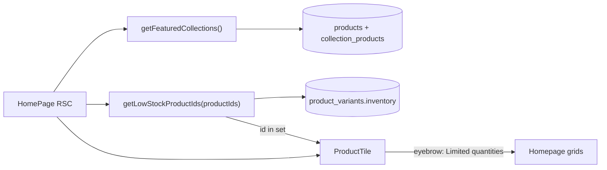

# BRK-2: Low-stock banner on homepage products

**Jira:** [BRK-2](https://fe-anysphere-demo.atlassian.net/browse/BRK-2)  
**Status:** To Do (prior "shipped" comments are stale demo resets)

## Problem

Shoppers browsing the homepage cannot tell which editorial pieces are running low. The PDP already shows an "Only N left" badge when a selected variant has inventory below 6, but product tiles never surface that signal.

## Goal

When any variant of a product has inventory **below 6**, show a **Limited quantities** eyebrow on that product's tile on the homepage.

## Scope (agreed in ticket comments)

Broader than the original one-line ticket: badge **all** homepage product tiles, not only the hero 2×2:

1. Hero 2×2 grid (first 4 Autumn/Woofer products)
2. "The season" 8-up grid
3. Both editorial collection grids (Black Tie, City Commuter)

Rationale: the hero and season grids render overlapping products; badging one but not the other would look like a bug.

Out of scope for this ticket: category PLPs, search, collection detail pages, cart.

## Behavior

| Rule | Detail |
| --- | --- |
| Threshold | Any variant with `inventory < 6` marks the product low-stock |
| Label | Exact copy: `Limited quantities` |
| Shared constant | Same threshold as PDP variant badge (`inventory < 6`) — centralized so they cannot drift |
| Non-low-stock | No eyebrow; tile stays clean |
| Seeded demos | Tartan House Trench (L=5), Destructed Cashmere Sweater (L=5), Opera Cape (all variants ≤5) |

## Architecture

### Modules

| Piece | Role |
| --- | --- |
| `src/lib/inventory.ts` | `LOW_STOCK_THRESHOLD` (6), `LOW_STOCK_EYEBROW` ("Limited quantities"), `isLowStock(n)`, `getLowStockProductIds(ids)` |
| `src/app/page.tsx` | Collect homepage product ids, batch-query low stock, pass eyebrow into each `ProductTile` |
| `src/components/commerce/product-tile.tsx` | Render eyebrow overlay on image tiles when provided (today only gradient fallback uses it) |
| `src/components/commerce/variant-selector.tsx` | Import `isLowStock` / threshold instead of hard-coded `6` |

## Acceptance criteria

- [ ] Homepage tiles whose product has any variant with inventory &lt; 6 show **Limited quantities**
- [ ] Tiles without low-stock variants do not show the eyebrow
- [ ] PDP stock badge uses the same shared threshold module
- [ ] Unit tests cover threshold helpers and `getLowStockProductIds` filtering
- [ ] Smoke check on `/` asserts `Limited quantities` is present

## Non-goals

- Changing seed inventory values
- Low-stock badges on non-homepage surfaces
- Decrementing inventory on add-to-cart (separate DEMO-TODO)
